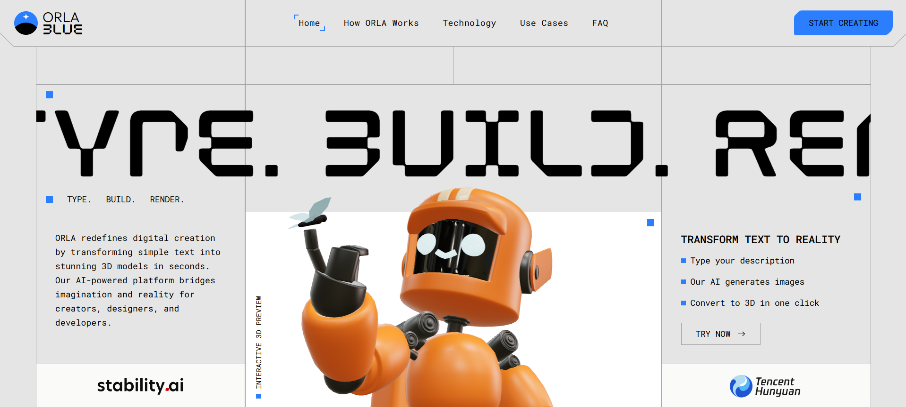

<div align="center">
  
  <h1 align="center" style="font-size: 3.5rem; margin-top: 10px; margin-bottom: 20px;">
    ORLA
  </h1>
  <p align="center">
    <b>AI-Powered 3D Model Generator</b>
  </p>
  <p align="center">
    <a href="#features">Features</a> •
    <a href="#screenshots">Screenshots</a> •
    <a href="#technology-stack">Technology</a> •
    <a href="#getting-started">Get Started</a>
  </p>
  <hr>
</div>

ORLA is a web application that transforms text prompts and images into detailed 3D models using advanced AI technologies. With an intuitive interface and powerful backend, ORLA enables users to generate high-quality 3D assets quickly and easily.

## Screenshots

<div align="center">
  
  <p><i>ORLA Homepage with main interface</i></p>
</div>

## Features

- **Text-to-3D Generation**: Create 3D models from textual descriptions
- **Image-to-3D Conversion**: Transform 2D images into detailed 3D models
- **Interactive 3D Viewer**: Examine and interact with generated models in real-time
- **Multiple Output Images**: View various angles and renderings of your 3D creation
- **User-Friendly Interface**: Modern, responsive design built with React and TypeScript

## Technology Stack

### Frontend
- **React 19** with TypeScript
- **Three.js** with React Three Fiber for 3D rendering
- **Tailwind CSS** for styling
- **Vite** as the build tool and development server

### Backend
- **FastAPI** for RESTful API endpoints
- **Celery** for asynchronous task processing
- **Redis** for task queue management
- **Hunyuan3D-2** AI model for 3D generation
- **Docker** for containerization

## Getting Started

### Prerequisites
- Node.js 18+ and npm
- Python 3.9+
- Docker and Docker Compose
- Hugging Face API token (for accessing the Hunyuan3D-2 model)

### Installation

1. **Clone the repository**
   ```bash
   git clone https://github.com/AgarwalYash14/ORLA.git
   cd ORLA
   ```

2. **Set up the frontend**
   ```bash
   cd client
   npm install
   ```

3. **Set up the backend**
   ```bash
   cd ../server
   ```

4. **Set environment variables**
   Create a `.env` file in the server directory:
   ```
   HUGGINGFACE_API_TOKEN=your_token_here
   ```

5. **Start the application with Docker**
   ```bash
   docker-compose up --build
   ```

6. **Access the application**
   Open your browser and navigate to `http://localhost:5173`

## Usage

1. **Enter a text prompt** describing the 3D model you want to generate
2. **Click "Generate"** and wait for the AI to process your request
3. **Select from generated images** to create a 3D model
4. **Interact with your 3D model** using mouse controls (orbit, pan, zoom)

## Project Structure

```
ORLA/
├── client/                # Frontend React application
│   ├── public/            # Static assets
│   └── src/
│       ├── assets/        # Images and other assets
│       ├── components/    # React components
│       ├── layout/        # Layout components
│       └── pages/         # Page components
└── server/                # Backend FastAPI application
    ├── app/
    │   ├── main.py        # FastAPI application
    │   ├── tasks.py       # Celery tasks
    │   └── model_generator.py # 3D model generation
    ├── Dockerfile         # Docker configuration
    └── docker-compose.yml # Docker Compose configuration
```

## Development

### Running the Frontend Locally
```bash
cd client
npm run dev
```

### Running the Backend Locally
```bash
cd server
pip install -r requirements.txt
uvicorn app.main:app --reload
```

In a separate terminal:
```bash
# Start Redis
docker run -p 6379:6379 redis
# Start Celery worker
cd server
celery -A app.tasks worker --loglevel=info
```

## Contributing

Contributions are welcome! Please feel free to submit a Pull Request.

## License

This project is licensed under the MIT License - see the LICENSE file for details.

## Acknowledgements

- [Hunyuan3D-2](https://huggingface.co/tencent/Hunyuan3D-2) by Tencent for the 3D model generation
- [React Three Fiber](https://github.com/pmndrs/react-three-fiber) for 3D rendering in React
- [FastAPI](https://fastapi.tiangolo.com/) for the backend API